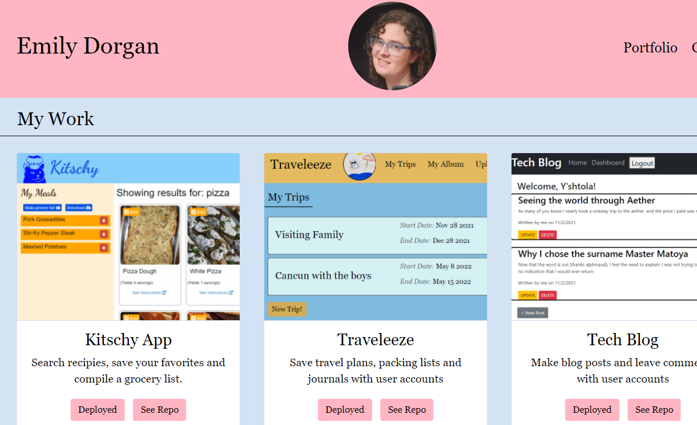
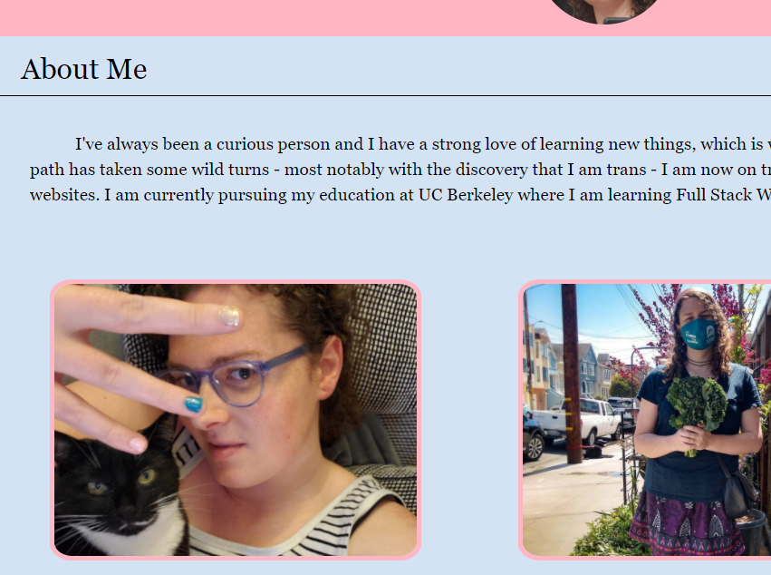
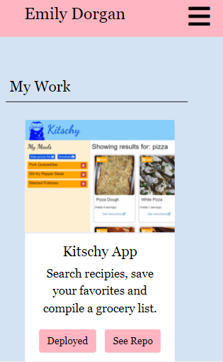

# Updated Portfolio

The portfolio has been rebuilt and a different color scheme and updated to display my lateset project and resume. The site is mobile responsive and I used bootstrap for the nav bar and cards displaying each project. Pictures in the about me now have a nice border around them

## Deployed Link

* [See Live Site](https://emdorgan.github.io/re-updated-portfolio/)

## Screenshots

## Built With

* [HTML](https://developer.mozilla.org/en-US/docs/Web/HTML)
* [CSS](https://developer.mozilla.org/en-US/docs/Web/CSS)
* [Bootstrap](https://getbootstrap.com/)

## Authors

* **Emily Dorgan** 

- [Link to Portfolio Site](https://emdorgan.github.io/updated-portfolio/)
- [Link to Github](https://github.com/emdorgan)
- [Link to LinkedIn](https://www.linkedin.com/in/emily-dorgan/)

## License

This project is licensed under the MIT License